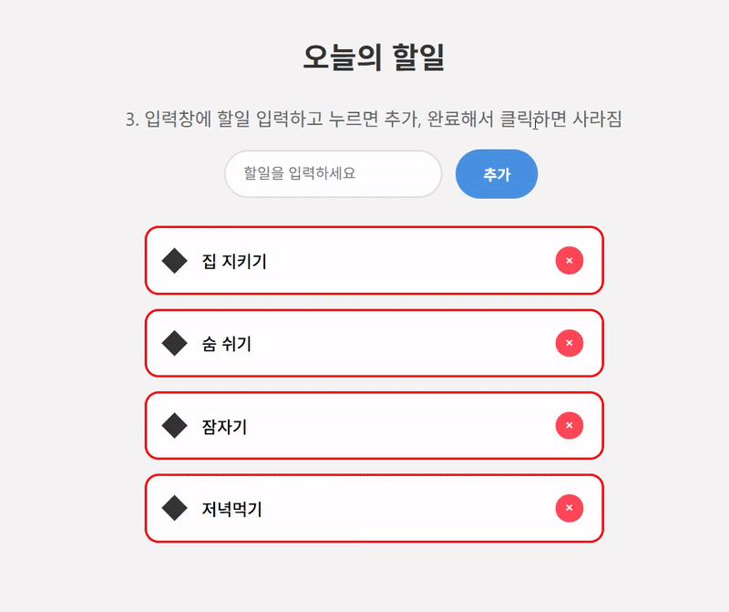

# 신호등 게임과 투두리스트

## 프로젝트 소개

- 개발 기간: 2024년 1월 중 어느 날 3일 동안
- 내용

  > 1. [신호등 게임 (traffic light)](#신호등-게임)
  > 2. [할 일 목록 (todo list)](#할-일-목록)

- 본 프로젝트는 엘리스 SW엔지니어 트랙 8기 수강 중 바닐라 자바스크립트를 공부하면서 만들어본 게임임.
- 컴퓨터를 정리하다가 로컬에 저장된 코드랑 PPT 파일이 있길래 한번 올려봄.
- PPT 감성이 진하게 느껴지는 허접하고 심플한 CSS로 꾸며짐.

## 신호등 게임

| Step | 기능 설명                                                                                    | 시연                          |
| ---- | -------------------------------------------------------------------------------------------- | ----------------------------- |
| 1    | 신호등에 마우스를 올리면 불빛이 들어오고, 마우스를 떼면 불빛이 꺼짐.                         |  |
| 2    | 신호등을 클릭하면 불빛이 켜지고, 다시 클릭하면 불빛이 꺼짐.                                  |  |
| 3    | 신호등에 마우스를 올리면 불빛이 켜지고, 신호등 바깥으로 마우스를 이동시키면 불빛이 꺼짐.     |  |
| 4    | 버튼 클릭 시 3, 2, 1 카운트다운 후 3초 뒤에 불빛이 켜짐.                                     |  |
| 5    | 신호등 1개가 빨강, 노랑, 초록 색으로 번갈아가며 변경됨. 각 색상은 위와 동일한 방식으로 동작. |  |

## 할 일 목록

| Step | 기능 설명                                                    | 시연                         |
| ---- | ------------------------------------------------------------ | ---------------------------- |
| 1    | 할일 목록 이미 로딩된 상태                                   |  |
| 2    | 완료해서 누르면 사라짐                                       |  |
| 3    | 입력창에 할일 입력하고 누르면 추가, 완료해서 클릭하면 사라짐 |  |
